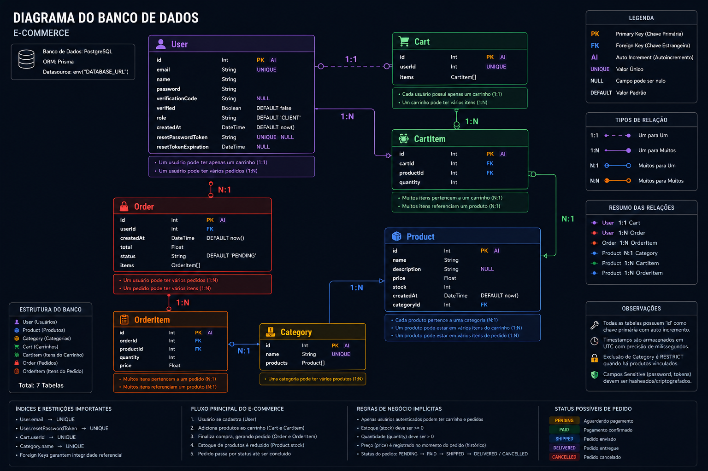

<div align="right">
  <a href="./README.pt.md">🇧🇷 Português</a>
</div>

<h1 align="center">🛒 E-commerce API</h1>

<p align="center">
  
  
  
  
  
  
  
  
  
</p>

---

## 📋 About

A complete RESTful API for an e-commerce platform, built as a **freelance project**. Covers the full shopping flow: authentication, product and category management, shopping cart, and order checkout. Features data validation via **Zod**, token-based auth with **JWT**, transactional emails via **Nodemailer**, and the **Prisma** ORM connected to **PostgreSQL**. The entire infrastructure is containerized with **Docker**, including a **pgAdmin** panel for database administration. Code quality is enforced with ESLint, Prettier, and EditorConfig.

---

## 🖥️ Preview


---

## 🗄️ Database Diagram



---

## 🛠 Tech Stack

| Layer | Technology | Purpose |
|---|---|---|
| **Runtime** | `Node.js + Express` | Server and routing |
| **Database** | `PostgreSQL + Prisma` | Relational data persistence and ORM |
| **DB Admin** | `pgAdmin` | Visual administration panel for PostgreSQL |
| **Authentication** | `JWT + Bcrypt.js` | Token-based auth and password hashing |
| **Validation** | `Zod` | Schema and input validation |
| **Email** | `Nodemailer` | Verification and password recovery emails |
| **Security** | `Express Rate Limit` | Spam and brute-force protection |
| **Infra** | `Docker + Docker Compose` | Containerized environment orchestration |
| **Code Quality** | `ESLint + Prettier + EditorConfig` | Consistent formatting across the codebase |

---

## 🗂️ Project Structure

```text
E-commerce/
├── prisma/
│   ├── migrations/               # Prisma migration history
│   ├── schema.prisma             # Database schema definition
│   └── seed.js                   # Initial data seeding script
├── src/
│   ├── Cart/
│   │   ├── controllers/
│   │   │   └── cartController.js     # Cart CRUD logic
│   │   └── routes/
│   │       └── cartRoutes.js         # Cart route definitions
│   ├── Order/
│   │   ├── controller/
│   │   │   └── orderController.js    # Order checkout logic
│   │   └── routes/
│   │       └── orderRoutes.js        # Order route definitions
│   ├── Stock/
│   │   ├── controllers/
│   │   │   ├── categoriesController.js  # Category CRUD logic
│   │   │   └── productController.js     # Product CRUD logic
│   │   └── routes/
│   │       ├── categoryRoutes.js     # Category route definitions
│   │       └── productRoutes.js      # Product route definitions
│   ├── User/
│   │   ├── controllers/
│   │   │   └── userController.js     # Auth and user management logic
│   │   └── routes/
│   │       └── userRoutes.js         # User route definitions
│   ├── lib/
│   │   └── prisma.js                 # Prisma client singleton
│   ├── middlewares/
│   │   ├── authMiddleware.js         # JWT verification middleware
│   │   └── rateLimit.js              # Rate limiting rules
│   └── services/
│       └── emailService.js           # Nodemailer email dispatch logic
├── .editorconfig                     # Editor formatting rules (indent, charset, EOL)
├── .env.example                      # Environment variable reference template
├── .eslintrc.json                    # ESLint rules and parser config
├── .prettierrc                       # Prettier formatting preferences
├── docker-compose.yml                # Multi-container orchestration config
├── Dockerfile                        # Production image build instructions
├── server.js                         # Application entry point
└── package.json
```

---

## 📡 API Endpoints

> 🔒 Routes marked with this lock require the header: `Authorization: Bearer <jwt_token>`
> 👑 Routes marked with this crown require the **ADMIN** role.

### Authentication & Users — `/user`

| Route | Method | Auth | Payload | Description |
|---|---|---|---|---|
| `/register` | POST | ❌ | `{"name","email","password"}` | Creates account and cart |
| `/verify-code` | POST | ❌ | `{"email","code"}` | Verifies email with code |
| `/login` | POST | ❌ | `{"email","password"}` | Returns a JWT token |
| `/reset-password` | POST | ❌ | `{"email"}` | Sends password recovery link |
| `/reset-password/:token` | POST | ❌ | `{"password"}` | Sets new password via token |
| `/users` | GET | 👑 | — | List all users |
| `/users/:id` | GET | 👑 | — | Get user by ID |
| `/users/:id` | DELETE | 👑 | — | Delete user by ID |

### Products — `/store/products`

| Route | Method | Auth | Payload | Description |
|---|---|---|---|---|
| `/` | POST | 👑 | `{"name","description","price","stock","categoryId"}` | Create a product |
| `/` | GET | ❌ | — | List all products |
| `/:id` | GET | ❌ | — | Get product by ID |
| `/:id` | PATCH | 👑 | `{"price"}` | Update a product |
| `/:id` | DELETE | 👑 | — | Delete a product |

### Categories — `/store/categories`

| Route | Method | Auth | Payload | Description |
|---|---|---|---|---|
| `/` | POST | 👑 | `{"name"}` | Create a category |
| `/` | GET | ❌ | — | List all categories |
| `/:id` | GET | ❌ | — | Get category by ID |
| `/:id` | PATCH | 👑 | `{"name"}` | Update a category |
| `/:id` | DELETE | 👑 | — | Delete a category |

### Cart — `/store/cart`

| Route | Method | Auth | Payload | Description |
|---|---|---|---|---|
| `/` | GET | 🔒 | — | View cart with items and products |
| `/item` | POST | 🔒 | `{"productId","quantity"}` | Add item to cart |
| `/item/:id` | PATCH | 🔒 | `{"quantity"}` | Update item quantity |
| `/item/:id` | DELETE | 🔒 | — | Remove item from cart |

> 💡 A cart is created automatically on account registration.

### Orders — `/store/orders`

| Route | Method | Auth | Payload | Description |
|---|---|---|---|---|
| `/` | POST | 🔒 | — | Checkout all items in the cart |
| `/` | GET | 🔒 | — | List all orders for the user |
| `/:id` | GET | 🔒 | — | Get order by ID |

> 💡 On checkout: the price is frozen at purchase time, stock is decremented, and the cart is cleared automatically.

---

## 🚀 Running Locally (Docker)

Make sure you have [Docker Desktop](https://www.docker.com/products/docker-desktop/) installed and running.

```bash
# 1. Clone the repository
git clone https://github.com/seu-usuario/e-commerce-api.git
cd e-commerce-api

# 2. Set up environment variables
cp .env.example .env
# Fill in your values in .env

# 3. Start the full infrastructure (API, Database, pgAdmin)
docker-compose up -d --build

# 4. Run database migrations
docker-compose exec api npx prisma migrate dev
```

### Local access

| Service | URL |
|---|---|
| API | `http://localhost:3000` |
| pgAdmin | `http://localhost:8080` (credentials from `.env`) |

---

## 📄 License

**MIT © Geovani Rodrigues**
